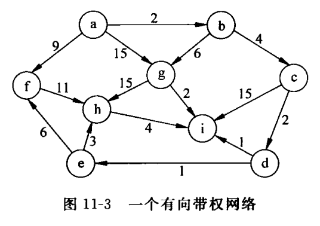

# 图的基本操作与实现

## 题目类别

基本数据结构类、搜索算法类

## 关键词

图、有向带权网络、DFS、BFS、连通图、最小生成树

## 问题描述

要求用邻接表存储结构，实现对图 11-3 所示的有向带权网络 `G` 的操作。

1. 输入含 `n`（`1 <= n <= 100`）个顶点（用字符表示顶点）和 `e` 条边。
2. 求每个顶点的出度和入度，输出结果。
3. 指定任意顶点 `x` 为初始顶点，对图 `G` 作 DFS 遍历，输出 DFS 顶点序列。
4. 指定任意顶点 `x` 为初始顶点，对图 `G` 作 BFS 遍历，输出 BFS 顶点序列。
5. 输入顶点 `x`，查找图 `G`：若存在含 `x` 的顶点，则删除该结点及与之相关联的边，并作 DFS 遍历；否则输出信息“无 `x`”。
6. 判断图 `G` 是否是连通图，输出信息 `YES` / `NO`。
7. 根据图 `G` 的邻接表创建图 `G` 的邻接矩阵，即复制图 `G`。
8. 找出该图的一棵最小生成树。

## 提示

图 11-3 是一个测试图例。在对图进行遍历时，若图非连通，那么一次遍历就不能访问到图中所有的顶点，需要在一次遍历后重新选择起点，继续进行下一次遍历，直到图中所有顶点均被访问到为止。由此也可以得到图是否连通的结论。
