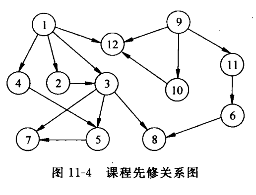

# 教学计划编制问题

## 题目类别

基本数据结构类

## 关键词

图、有向无环图、拓扑排序、教学计划

## 问题描述

大学的每个专业都要制定教学计划。假设任何专业都有固定的学习年限，每学年含两个学期，每学期的时间长度和学分上限值均相等。每个专业开设的课程都是确定的，而且课程在开设时间的安排必须满足先修关系。每门课有哪些先修课程是确定的，可以有任意多门，也可以没有。每门课恰好占一个学期。试在这样的前提下设计一个教学计划编制程序。具体要求如下：

1. 输入参数：学期总数、一学期的学分上限，每门课的课程号（固定占 `3` 位的字母数字串）、学分和直接先修课的课程号。
2. 允许用户指定下列两种编排策略之一：一是使学生在各学期中的学习负担尽量均匀；二是使课程尽可能地集中在前几个学期中。
3. 若根据给定的条件问题无解，则报告适当的信息；否则将教学计划输出到用户指定的文件中。计划的表格格式自行设计。

## 提示

可设学期总数不超过 `12`，课程总数不超过 `100`。如果输入的先修课程号不在该专业开设的课程序列中，则作为错误处理。同时还应建立课程号与课程号之间的对应关系。

## 测试数据

学期总数：`6`；学分上限：`10`；该专业共开设 `12` 门课，课程号从 `C01` 到 `C12`，学分顺序为 `2,3,4,3,2,3,4,4,7,5,2,3`。先修关系如图 11-4 所示。

