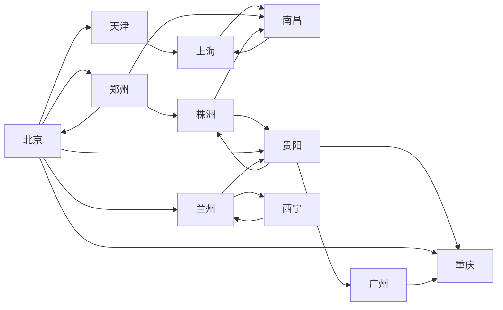

# 全国交通咨询模拟

## 题目类别

基本数据结构类、贪心算法类、搜索算法类

## 关键词

图、最小生成树、PRIM、贪心算法

## 问题描述

处于不同目的的旅客对交通工具有不同的要求。例如，因公出差的旅客希望在旅途中的时间尽可能地短，出门旅游的游客期望旅费尽可能省，而老年旅客则要求中转次数最少。本题目要求编制一个全国城市的交通咨询程序，为旅客提供两种或三种最优决策的交通咨询。具体要求如下：

1. 提供对城市信息进行编辑（如：添加或删除）的功能。
2. 城市之间的交通工具是火车。提供对列车时刻表的管理功能（增加、删除、查询、修改）。
3. 提供两种最优决策：最快到达和最省钱到达。
4. 旅途中耗费的总时间应该包括中转站的等候时间。
5. 咨询以用户和计算机的对话方式进行。由用户输入起始站、终点站、最优决策原则，输出信息：最快需要多长时间才能到达或者最少需要多少旅费才能到达，并详细说明依次于何时乘坐哪一趟列车到何地。
6. 旅途中转次数最少的最优决策。

测试例如图 11-5 所示。

图 11-5 城市交通图

## 提示

1. 对全国城市交通图和列车时刻表进行编辑，应该提供文件形式输入和键盘输入两种方式。列车时刻信息应包括：起始站的出发时间、终点站的到达时间和票价；例如：从北京到上海的火车，需给出北京至天津、天津至上海等各段的出发时间、到达时间及票价等信息。
2. 以邻接表作交通图的存储结构，表示边的结构内除含有邻接点的信息外，还应包括某段路程耗费的时间、费用、出发时间、到达时间等多种属性。

