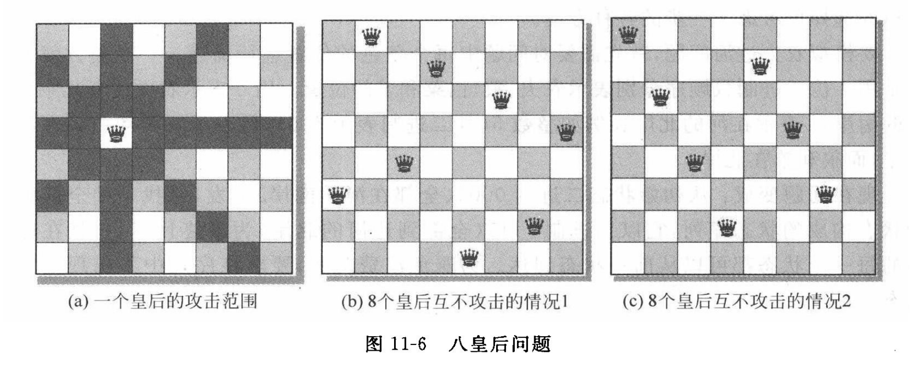

# 八皇后问题

## 题目类别

搜索算法类

## 关键词

国际象棋、深度搜索、广度搜索、回溯、栈、队列、穷举、递归

## 问题描述

八皇后问题是一个古老而著名的问题，它是回溯算法的典型例题。该问题是 19 世纪德国著名数学家高斯于 1850 年提出的：在 8 行 8 列的国际象棋棋盘上摆放着 8 个皇后。若两个皇后位于同一行、同一列或同一对角线上，则称为它们为互相攻击。在国际象棋中皇后是最强大的棋子，因为它的攻击范围最大，图 11-6(a) 显示了一个皇后的攻击范围。

本题目的要求是：编程解决八皇后问题。在 `8×8` 的棋盘上，放置 `8` 个皇后。要求使这 `8` 个皇后不能相互攻击，即每一横行、每一列、每一对角线上均只能放置一个皇后，求出所有可能的方案，输出这些方案，并统计方案总数。

## 示意图

