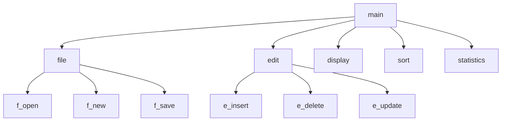

# 简单个人图书管理系统的设计与实现

## 题目类别

基本数据结构类、排序类、查找类

## 关键词

线性表、单链表、排序、查询

## 问题描述

学生在自己的学习和生活中会拥有很多的书籍，对所购买的书籍进行分类和统计是一种良好的习惯。可以便于对这些知识资料的整理和查询使用。如果用文件来存储相关书籍的各种信息，包括分类、购买日期、价格、简介等，然后通过程序来使用这些存储好的书籍信息，对其进行统计和查询，将使书籍管理工作变得更加轻松而有趣。这就是简单个人书籍管理系统的开发目的。

该系统具备如下的功能：

1. 定义一个菜单，方便用户实现下述操作。要求菜单简洁、易操作、界面美观。
2. 能用磁盘文件存储书籍的各种相关信息，并能实现对磁盘文件信息的读取。
3. 实现图书信息的添加、修改、删除操作。
4. 提供查询功能，可按多种关键字查找需要的书籍，而且在查找成功后可以修改书籍记录的相关项。
5. 提供排序功能，可按照多种关键字对书籍进行排序，例如按照价格进行排序。

## 提示

由于书籍的册数较多，且数量不确定，因此本题可用链表来记录图书信息。假设建立了图书链表 `books`，后续描述将针对 `books` 进行。为使程序未运行时仍然保持书里面的数据，所以应将数据保存到外存储器的文件中。需要操作时，将数据从文件中调入内存表进行处理。

## 功能（函数）设计

本系统的功能模块如图 11-1 所示。各个功能模块的含义如下：

图 11-1 系统功能模块划分

1. “主函数”模块 `main()`
   此模块循环显示主菜单，可接收键盘输入的命令，检查命令是否合法，若合法则调用相应下层函数。命令菜单中应包含“退出系统”命令。
2. “文件”模块 `file()`
   此模块循环显示“文件操作”命令菜单，接收键盘输入的命令，检查命令是否合法，若合法则调用相应下层函数。命令菜单中应包含“返回上一级菜单”命令。
3. “新建”模块 `f_new()`
   此模块清空图书数据表；进入输入状态，接收键盘输入的全部数据保存在 `books` 表中。
4. “打开”模块 `f_open()`
   此模块清除 `books` 表中原有数据，从磁盘的数据文件中读入全部数据到 `books` 中，并将全部数据按读入顺序显示在屏幕上。
5. “保存”模块 `f_save()`
   此模块将 `books` 表中全部有效数据保存到磁盘文件中。
6. “编辑”模块 `edit()`
   此模块循环显示“编辑操作”命令菜单，可接收键盘输入命令，如命令合法则调用相应下层函数。命令菜单中应包含“返回上一级菜单”命令。
7. “插入”模块 `e_insert()`
   此模块接收从键盘输入的一条新的记录，按“购买日期”顺序插入到 `books` 表中。
8. “删除”模块 `e_delete()`
   此模块接收从键盘输入的一条记录的“购买日期”和“书名”，在 `books` 表中查找，如找到则从表中删除该记录，否则显示“未找到”。
9. “更新”模块 `e_update()`
   此模块接收从键盘输入的一条记录的“购买日期”和“书名”，在 `books` 表中查找，如找到则显示该记录的原数据，并提示键盘输入新数据用以替换原有数据；如未找到则显示“未找到”。
10. “显示”模块 `display()`
    此模块显示类别名称和编号，提示用户输入图书类别的编号，显示 `books` 表中相应类别的书籍记录；若输入“11”显示全部书籍记录。
11. “排序”模块 `sort()`
    此模块可对 `books` 表中所有记录进行排序。排序可按“类别”、“采购日期”、“单价”分别进行，并显示排序结果。要求“类别”相同时按“书名”排序（字典序）。
12. “统计”模块 `statistics()`
    此模块统计各类书籍的数量，显示统计结果。
