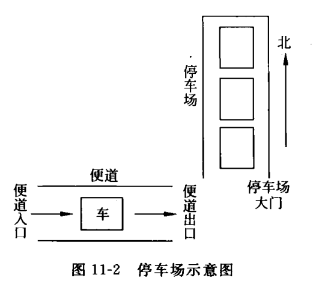

# 停车场模拟管理程序

## 题目类别

基本数据结构类

## 关键词

栈、先进后出、队列、先进先出

## 问题描述

设停车场只有一个可停放几辆汽车的狭长通道，且只有一个大门可供汽车进出，汽车在停车场内按车辆到达的先后顺序，队尾从北向南依次排列。若大门口处恰好没有车辆离开，则后到达的车辆停在最北端。若停车场内已停满 `n` 辆，则后来的汽车只能在门外的便道上等候。一旦停车场内有车开走，则排在便道上的第一辆车即可进入；当甲车离开时，为甲车后方阻塞着而不能离开的车，需先从停车场开出，待甲车开出后再入内，方可让它前面的车辆再按原次序进入车场。

在这里假设汽车不能从便道上开走。如图 11-2 所示。



设计一个停车场模拟管理程序。要求实现如下操作：

1. 定义一个主菜单，方便用户实现下述操作。要求菜单简洁、易操作、界面美观。
2. 根据车辆到达停车场和离开停车场的时间进行计时收费。
3. 模拟车辆的进入和离开过程。当有车辆离开时，等待的车辆依次进入停车场。
4. 可以显示停车场信息和便道的信息。

## 提示

1. 为便于区分汽车停放或等待时所处的位置，需要记录汽车的牌照号和汽车的当前状态，所以为汽车定义类型 `CAR`，参考定义如下：

```c
typedef struct
{
    char *license_plate;   // 汽车牌照号码，定义为一个字符串指针变量
    char state;            // 汽车的当前状态
} CAR
```

2. 由于停车位是一个狭长的通道，不允许两辆车同时进入停车位，当有车要进入停泊位时，要顺次停放；当某辆车要离开时，它后到的车要先暂时退出停车位，待该车离开后再按原顺序返回，因此可以借用一个栈来描述停车位。由于停车位只能够放有限的几辆车，为便于停车场管理，设为每个车位分配一个固定的编号，不妨设为 `1,2,3,4,5`（可利用数组的下标），分别表示停车位的 `1` 车位、`2` 车位、`3` 车位、`4` 车位、`5` 车位，因此使用顺序栈比较方便描述，参考定义如下：

```c
#define MAX_STOP 5
typedef struct
{
    CAR STOP[MAX_STOP];    // 停车位信息的存储空间
    int top;               // 用来指示栈顶位置的静态指针
} STOPPING;
```

3. 当停车位都已停满汽车，又有新的汽车到来时，则要把它停到便道处。便道上的车辆要按照进入便道的先后顺序依次排放，为便道的每个位置也分配一个编号。当有车从停车位上离开时，便道上的第一辆汽车就立即进入停车位。显然，这和队列的“先进先出”特点相吻合。可使用一个顺序队列来描述便道，参考定义如下：

```c
#define MAX_PAVE 100
typedef struct
{
    CAR PAVE[MAX_PAVE];    // 停车场便道的存储空间
    int front, rear;       // 用来指示队头和队尾位置的静态指针
} PAVEMENT;
```

4. 当某辆车要离开停车场的时候，比它后进入车位的车要为它让路，且当它离开后，让路的车还要按照原来的停放次序再次进入停车位。为完成这一功能，可再定义一个辅助栈，把临时退出的车依次“压入”辅助栈，待目标车辆开走后，再从辅助栈中依次“弹出”回到停车位中。辅助栈也可采用顺序栈，参考定义如下：

```c
typedef struct
{
    CAR BUFFER[MAX_STOP];  // 停车信息的存储空间
    int top;               // 用来指示栈顶位置的静态指针
} BUFFER;
```

## 功能（函数）设计

由此程序的各类数据结构需要频繁进行操作，而且每次操作的结果都要及时反映出来以便显示，所以在程序设计时，使用以上类型定义的变量可采用全局变量的形式。

本程序总体可分为 4 个功能模块，分别为：程序功能介绍和操作提示模块、汽车进入停车位的管理模块、汽车离开停车位的管理模块、查看停车场状态的查询模块。具体描述如下：

- 程序功能介绍与操作提示模块：此模块给出程序欢迎信息，介绍本程序的功能，并给出程序功能所对应的键盘操作提示。
- 汽车进入停车位的管理模块：此模块用于登记停车场汽车的车牌号和到达停车场的时间，并修改停车状态。其中调度过程要判断是否有空余车位，用于指导用户对车辆进行调度。例如，当停车位上 `1,2,3` 车位分别停放着牌照为 `JF001`、`JF002`、`JF003` 的汽车，便道上无汽车，当牌照为 `JF004` 的汽车到来后，屏幕应给出如下提示信息：牌照为 `JF004` 的汽车进入停车位的 `4` 号车位。
- 汽车离开停车位的管理模块：此模块用于对要离开的车辆做调度，并修改相关车辆的状态。其中调度过程要以屏幕信息的形式反馈给用户。当有车要开停车场后，应动态检查便道上是否有车，如果有车的话应立即让便道上的第一辆车进入停车位。例如，当前停车位上 `1,2,3,4,5` 车位分别停放着牌照为 `JF001`、`JF002`、`JF003`、`JF004`、`JF005` 的汽车，便道上的 `1,2` 位置分别停放着牌照为 `JF006`、`JF007` 的汽车，当接收到 `JF003` 要离开的信息时，屏幕应给出如下提示信息：

```text
牌照为 JF005 的汽车暂时退出停车位；
牌照为 JF004 的汽车暂时退出停车位；
牌照为 JF003 的汽车从停车场开走；
牌照为 JF004 的汽车回停车位的 3 车位；
牌照为 JF005 的汽车回停车位的 4 车位；
牌照为 JF006 的汽车从便道上进入停车位的 5 车位；
```

按此方式继续运行程序。

- 查看停车场停车状态的查询模块：此模块用于显示停车位和便道上停车的状态。例如，当停车位上 `1,2,3,4,5` 车位分别停放着牌照为 `JF001`、`JF002`、`JF003`、`JF004`、`JF005` 的汽车，便道上的 `1,2` 位置分别停放着牌照为 `JF006`、`JF007` 的汽车，当接收到查看指令后，屏幕上应显示：

```text
停车位：
1 车位 ---- JF001；
2 车位 ---- JF002；
3 车位 ---- JF003；
4 车位 ---- JF004；
5 车位 ---- JF005；
便道上的位置：
1 位置 ---- JF006；
2 位置 ---- JF007；
```

## 界面设计

本程序的界面力求简洁、友好，每一步都要用户操作的提示以及每一次用户操作产生的信息反馈。
