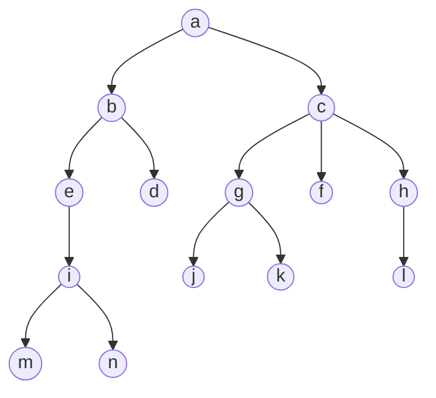
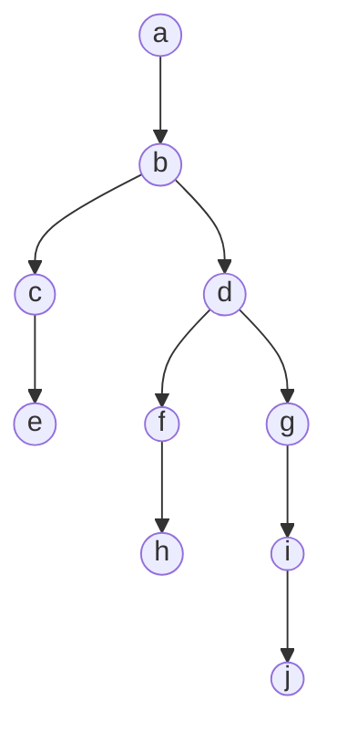
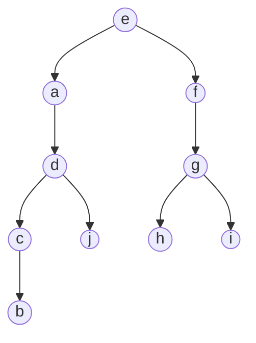
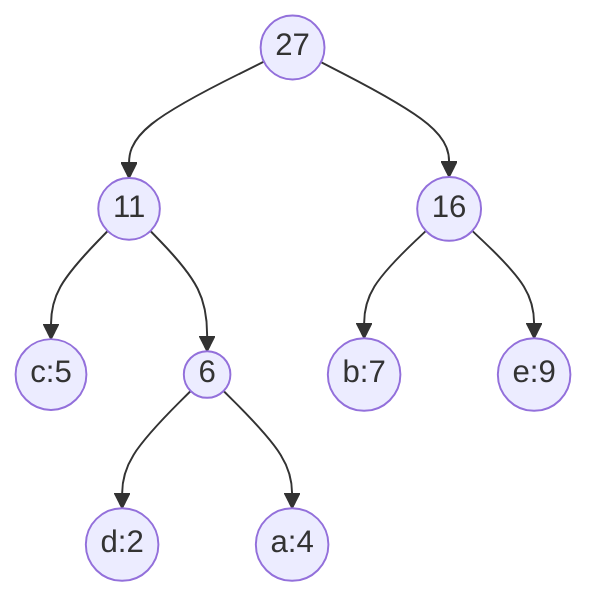
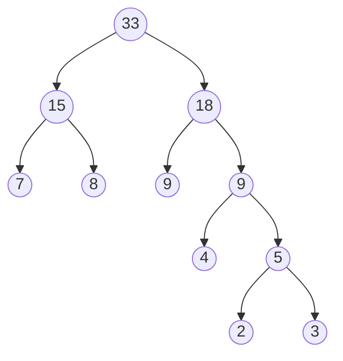

# 第六章作业（树）

### 6.2.1 基础题

#### 单项选择题

1. A
2. C
3. B
4. C
5. D
6. B
7. B
8. D
9. A
10. D
11. D
12. C
13. C
14. D
15. C
16. C
17. B
18. D
19. A
20. B

#### 填空题

1.  
   (1) `k1`  
   (2) `k2、k4、k5、k7`  
   (3) `2`  
   (4) `3`  
   (5) `4`  
   (6) `k5、k6`  
   (7) `k1`

2.  
   (1) `2^(k-1)`  
   (2) `2^k-1`  
   (3) `⌊n/2⌋+1`

3.  
   (1) `2^(i-1)`  
   (2) `(n+1)/2`  
   (3) `(n-1)/2`

4.  
   (1) `单结点树`  
   (2) `空二叉树`

5.  
   (1) `5`  
   (2) `左左型、左右型、左右子树型、右左型、右右型`

6. `⌊log2 n⌋+1`

7. `a(b,∅)，b(∅,c)，c(e,d)，d(g,∅)，e(∅,f)，f(∅,g)，g(∅,∅)`  
   其中每个结点后的二元组表示 `(第一个孩子, 下一个兄弟)`。

8.  
   (1) `((12,(6,7)),(18,((4,5),10)))`  
   (2) `165`

9.  
   (1) `最小`  
   (2) `更近`

### 6.2.2 综合题

#### 1



1. 根结点：`a`
2. 叶子结点：`d、f、j、k、l、m、n`
3. 结点 `g` 的双亲：`c`
4. 结点 `g` 的祖先：`c、a`
5. 结点 `g` 的孩子：`j、k`
6. 结点 `e` 的子孙：`i、m、n`
7. 结点 `e` 的兄弟：`d`；结点 `f` 的兄弟：`g、h`
8. 结点 `b` 和结点 `n` 的层次号：`2`，`5`
9. 树的深度：`5`
10. 以结点 `c` 为根的子树的深度：`3`
11. 树的度数：`3`

#### 2（1）（2）



1. 二叉树 `bt` 的逻辑结构如上图。
2. 遍历结果：  
   先序遍历：`abcedfhgij`  
   中序遍历：`ecbhfdjiga`  
   后序遍历：`echfjigdba`

#### 3



1. 二叉树的逻辑结构如上图。
2. 遍历结果：  
   前序遍历：`eadcbjfGhi`  
   中序遍历：`abcdjefhGi`  
   后序遍历：`bcjdahiGfe`
3. 结点值 `c` 的父结点是 `d`，左孩子是 `b`，右孩子是 `空`。

#### 7

哈夫曼树：



各字符的哈夫曼编码：

| 字符 | 编码 |
| --- | --- |
| a | `011` |
| b | `10` |
| c | `00` |
| d | `010` |
| e | `11` |

#### 8

关于 `w={2，3，4，7，8，9}` 的一棵哈夫曼树：



`WPL = 80`

### 13

```text
fun swap_left_right(bt):
    // 如果二叉树为空，直接返回
    if bt == NULL:
        return

    // 先把左孩子指针暂时保存起来
    temp = bt.left
    // 让当前结点的左、右子树互换
    bt.left = bt.right
    bt.right = temp

    // 继续交换左子树和右子树的内部结构
    swap_left_right(bt.left)
    swap_left_right(bt.right)
```

### 15

```text
fun count_single_child(bt):
    // 空树中没有单孩子结点
    if bt == NULL:
        return 0

    count = 0

    // 只有左孩子或只有右孩子时，当前结点就是单孩子结点
    if (bt.left == NULL and bt.right != NULL) or
       (bt.left != NULL and bt.right == NULL):
        count = 1

    // 当前结点的统计结果，加上左右子树中的统计结果
    return count
         + count_single_child(bt.left)
         + count_single_child(bt.right)
```

### 19

```text
fun count_leaf(t):
    // 空树或空兄弟链，不产生叶子结点
    if t == NULL:
        return 0

    // 没有第一个孩子，说明当前结点就是叶子
    // 统计完当前叶子后，继续统计它后面的兄弟结点
    if t.first_child == NULL:
        return 1 + count_leaf(t.next_sibling)

    // 先统计孩子子树中的叶子，再统计兄弟子树中的叶子
    return count_leaf(t.first_child) + count_leaf(t.next_sibling)
```

### 20

```text
fun tree_depth(t):
    // 空树深度为 0
    if t == NULL:
        return 0

    max_depth = 0
    // p 用来依次扫描当前结点的所有孩子
    p = t.first_child

    while p != NULL:
        // 递归求每个孩子子树的深度
        d = tree_depth(p)
        // 保存其中最大的那个深度
        if d > max_depth:
            max_depth = d
        // 转到当前孩子的下一个兄弟
        p = p.next_sibling

    // 再把当前根结点这一层加上
    return max_depth + 1
```
