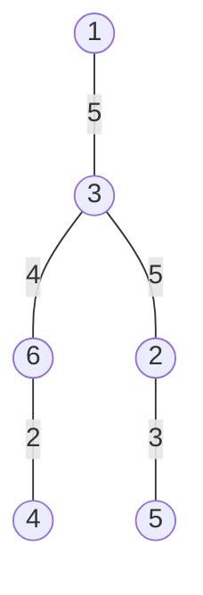
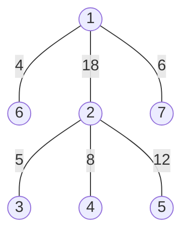

# 第七章作业（图）

### 7.2.1 基础题

#### 单项选择题

1. C
2. B
3. C
4. A
5. A
6. C
7. D
8. C
9.  
   (1) D  
   (2) B
10.  
   (1) C  
   (2) B

#### 填空题

1. `n-1`
2.  
   (1) `1`  
   (2) `0`
3. `1`

### 7.2.2 综合题

#### 1

邻接矩阵：

|  | 1 | 2 | 3 | 4 | 5 |
| --- | --- | --- | --- | --- | --- |
| 1 | 0 | 1 | 1 | 1 | 0 |
| 2 | 1 | 0 | 1 | 0 | 1 |
| 3 | 1 | 1 | 0 | 1 | 1 |
| 4 | 1 | 0 | 1 | 0 | 1 |
| 5 | 0 | 1 | 1 | 1 | 0 |

邻接表：

```text
1 -> 2 -> 3 -> 4
2 -> 1 -> 3 -> 5
3 -> 1 -> 2 -> 4 -> 5
4 -> 1 -> 3 -> 5
5 -> 2 -> 3 -> 4
```

#### 2

按顶点编号从小到大访问邻接点：

1. 广度优先搜索序列：`1，2，3，4，5，6，8，7`
2. 深度优先搜索序列：`1，2，3，6，4，5，7，8`

#### 3

从顶点 `1` 开始使用普里姆算法，一棵最小生成树为：



选边顺序：

1. `(1,3)`，权值 `5`
2. `(3,6)`，权值 `4`
3. `(6,4)`，权值 `2`
4. `(3,2)`，权值 `5`
5. `(2,5)`，权值 `3`

最小生成树的权值和为 `19`。

#### 4

使用克鲁斯卡尔算法，一棵最小生成树为：



选边顺序：

1. `(1,6)`，权值 `4`
2. `(2,3)`，权值 `5`
3. `(1,7)`，权值 `6`
4. `(2,4)`，权值 `8`
5. `(2,5)`，权值 `12`
6. `(1,2)`，权值 `18`

最小生成树的权值和为 `53`。

#### 5

1. 从顶点 `8` 出发的搜索序列为：

```text
8，4，2，1，3，6，7，5
```

2. `p` 的变化过程为：

```text
dfs(8): p -> 4 -> 5 -> 6 -> 7 -> NULL
dfs(4): p -> 2 -> 8 -> NULL
dfs(2): p -> 1 -> 4 -> 5 -> NULL
dfs(1): p -> 2 -> 3 -> NULL
dfs(3): p -> 1 -> 6 -> 7 -> NULL
dfs(6): p -> 3 -> 8 -> NULL
dfs(7): p -> 3 -> 8 -> NULL
dfs(5): p -> 2 -> 8 -> NULL
```

#### 11

```text
fun exist_path_dfs(G, vi, vj):
    // 先把所有顶点标记为没有访问过
    for i = 1 to G.vexnum:
        visited[i] = 0

    // 从 vi 开始做深度优先搜索
    return dfs_search(G, vi, vj)

fun dfs_search(G, v, vj):
    // 当前顶点已经到达，避免后面重复访问
    visited[v] = 1

    // p 指向顶点 v 的第一条出边
    p = G.adjlist[v].first
    while p != NULL:
        w = p.adjvex

        // 找到目标顶点，说明路径存在
        if w == vj:
            return true

        // 没访问过的邻接点继续递归查找
        if visited[w] == 0:
            if dfs_search(G, w, vj) == true:
                return true

        // 查看下一条出边
        p = p.next

    return false
```

#### 12

```text
fun exist_path_bfs(G, vi, vj):
    // 初始化访问标志
    for i = 1 to G.vexnum:
        visited[i] = 0

    init_queue(Q)
    // 起点先入队
    visited[vi] = 1
    en_queue(Q, vi)

    while queue_empty(Q) == false:
        // 取出队头顶点，再查看它的所有出边
        v = de_queue(Q)

        p = G.adjlist[v].first
        while p != NULL:
            w = p.adjvex

            // 邻接点就是 vj 时，查找成功
            if w == vj:
                return true

            // 第一次遇到的顶点入队，等待后面继续扩展
            if visited[w] == 0:
                visited[w] = 1
                en_queue(Q, w)

            // 继续检查下一条出边
            p = p.next

    return false
```

#### 20

```text
fun Dijkstra(G, s):
    // dist 保存当前最短距离，path 保存前驱顶点
    for i = 1 to G.vexnum:
        dist[i] = INF
        path[i] = 0
        final[i] = 0

    // 源点到自己的距离为 0
    dist[s] = 0

    for i = 1 to G.vexnum:
        min = INF
        v = 0

        // 在还没有确定最短路径的顶点中，选 dist 最小的顶点
        for j = 1 to G.vexnum:
            if final[j] == 0 and dist[j] < min:
                min = dist[j]
                v = j

        // 剩下的顶点都不可达时结束
        if v == 0:
            break

        // 顶点 v 的最短路径已经确定
        final[v] = 1

        // 扫描 v 的邻接表，尝试更新相邻顶点的距离
        p = G.adjlist[v].first
        while p != NULL:
            w = p.adjvex
            weight = p.weight

            // 通过 v 到达 w 更短，就修改 dist 和前驱
            if final[w] == 0 and dist[v] + weight < dist[w]:
                dist[w] = dist[v] + weight
                path[w] = v

            // 继续下一条边
            p = p.next

    return dist, path
```
