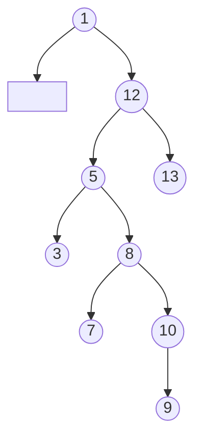
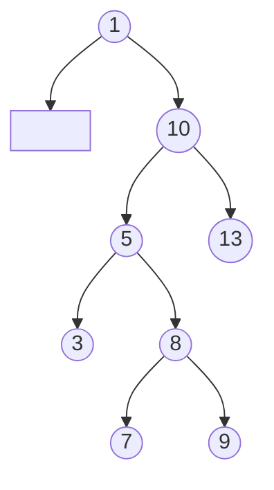
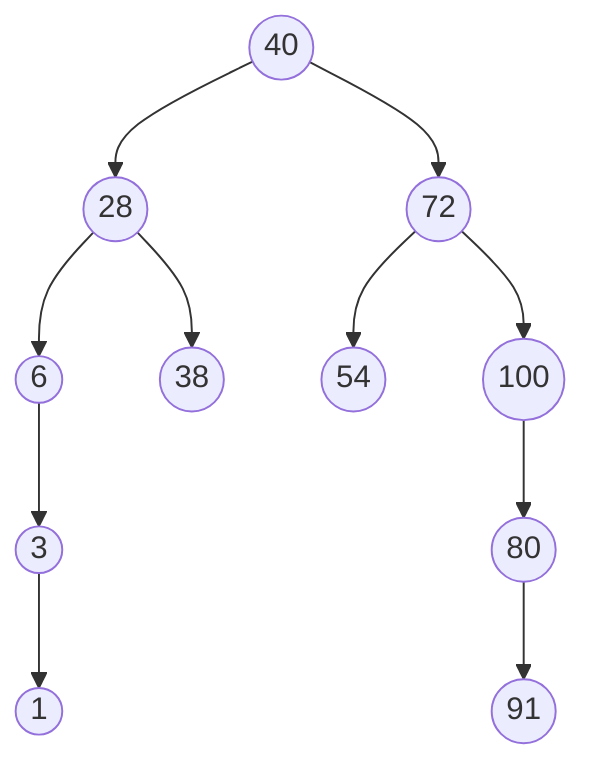
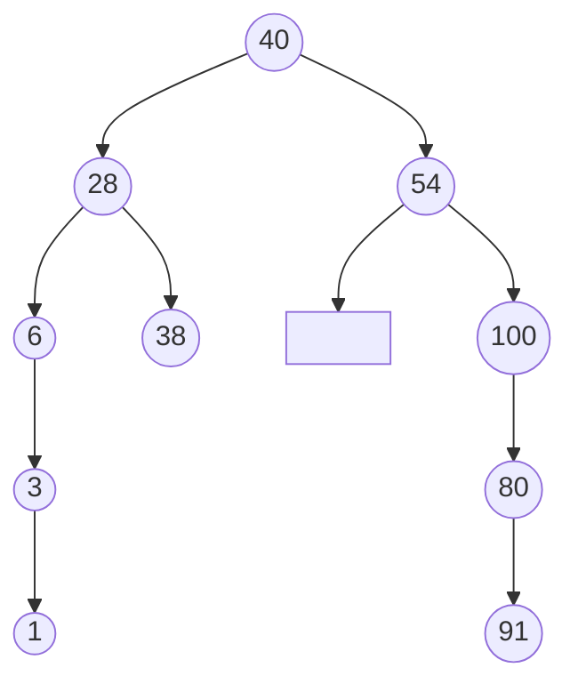
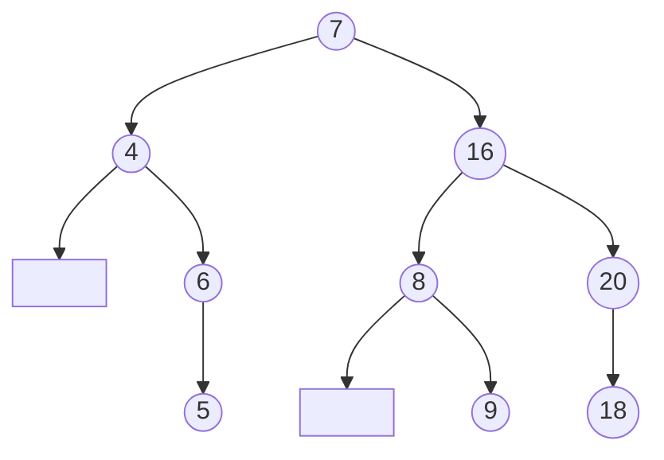

# 第八章作业（查找）

### 8.2.1 基础题

#### 单项选择题

1. B
2. C
3. C
4. D
5. D
6. A
7. C
8. A
9. A

#### 填空题

1.  
   (1) `(n+1)/2`  
   (2) `1+α/2`
2. 散列查找
3. 以关键字有序排列的顺序表
4. `16`
5. `⌊log2N⌋+1`
6.  
   (1) `O(n)`  
   (2) `O(log2n)`  
   (3) `O(√n)`

### 8.2.2 综合题

#### 1

拉链法散列表：

| 地址 | 结点 |
| --- | --- |
| 0 | 39 |
| 1 |  |
| 2 | 28 -> 15 |
| 3 | 42 |
| 4 |  |
| 5 | 44 |
| 6 | 06 |
| 7 |  |
| 8 |  |
| 9 |  |
| 10 | 36 |
| 11 |  |
| 12 | 38 -> 12 -> 25 |

线性探测法散列表：

| 地址 | 0 | 1 | 2 | 3 | 4 | 5 | 6 | 7 | 8 | 9 | 10 | 11 | 12 |
| --- | --- | --- | --- | --- | --- | --- | --- | --- | --- | --- | --- | --- | --- |
| 关键字 | 39 | 12 | 28 | 15 | 42 | 44 | 06 | 25 |  |  | 36 |  | 38 |

拉链法：

```text
ASL成功 = (1+1+1+1+1+2+1+2+1+3) / 10 = 14/10 = 1.4
ASL失败 = (1+0+2+1+0+1+1+0+0+0+1+0+3) / 13 = 10/13
```

线性探测法：

```text
ASL成功 = (1+1+1+1+1+2+2+3+1+9) / 10 = 23/10 = 2.3
ASL失败 = (9+8+7+6+5+4+3+2+1+1+2+1+10) / 13 = 59/13
```

#### 2

链表结构：

| 地址 | 结点 |
| --- | --- |
| 0 |  |
| 1 | 27 |
| 2 | 132 |
| 3 | 68 |
| 4 | 95 |
| 5 | 187 -> 70 |
| 6 | 123 |
| 7 | 7 |
| 8 | 08 |
| 9 | 87 |
| 10 |  |
| 11 | 310 -> 63 |
| 12 | 25 |

```text
ASL成功 = (1+1+1+1+1+2+1+1+1+1+1+2+1) / 13 = 15/13
```

#### 6

```text
fun BinSearch(A, low, high, key):
    if low > high:
        return 0

    mid = (low + high) / 2

    if A[mid] == key:
        return mid
    else if A[mid] > key:
        return BinSearch(A, low, mid - 1, key)
    else:
        return BinSearch(A, mid + 1, high, key)
```

#### 9

```text
fun IsBST(T):
    init_stack(S)
    p = T
    has_pre = false

    while p != NULL or stack_empty(S) == false:
        while p != NULL:
            push(S, p)
            p = p.lchild

        p = pop(S)

        if has_pre == true and p.key <= pre:
            return false

        pre = p.key
        has_pre = true
        p = p.rchild

    return true
```

#### 12

```text
fun PrintGEByDesc(T, x):
    init_stack(S)
    p = T

    while p != NULL or stack_empty(S) == false:
        while p != NULL:
            push(S, p)
            p = p.rchild

        p = pop(S)

        if p.key >= x:
            output p.key
            p = p.lchild
        else:
            break
```

#### 15

```text
fun MergeBST(T1, T2):
    if T2 == NULL:
        return T1

    init_stack(S)
    p = T2

    while p != NULL or stack_empty(S) == false:
        while p != NULL:
            push(S, p)
            p = p.lchild

        p = pop(S)
        InsertBST(T1, p.key)
        p = p.rchild

    return T1

fun InsertBST(T, key):
    if T == NULL:
        T = new_node(key)
        return T

    p = T
    parent = NULL

    while p != NULL:
        parent = p
        if key == p.key:
            return T
        else if key < p.key:
            p = p.lchild
        else:
            p = p.rchild

    s = new_node(key)
    if key < parent.key:
        parent.lchild = s
    else:
        parent.rchild = s

    return T
```

### 6.2.2 综合题

#### 4

(1)



(2)

```text
1，3，5，7，8，9，10，12，13
```

(3)



#### 5

删除前：



删除结点 72 后：



#### 6

二叉排序树：



(1)

```text
R1 = 4，5，6，7，8，9，16，18，20
```

(2)

```text
R2 = 5，6，4，9，8，18，20，16，7
```
